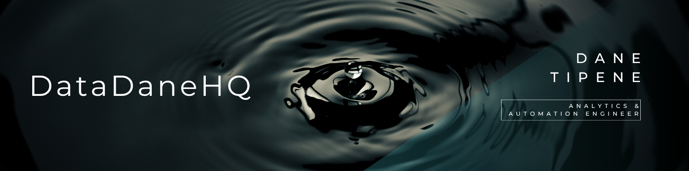

 

## I walk into broken, expensive, manual processes and automate them out of existence.

Analytics & Automation Engineer based in Melbourne, Australia.

I've delivered enterprise-grade automation inside one of Victoria's most regulated government environments — including the organisation's first locally-deployed, multi-model AI pipeline, processing ~3,500 enforcement call recordings with strict privacy maintained throughout.

**What that looks like in practice:**  
- ~3,500 call recordings transcribed at scale — speaker-labelled, privacy-preserving, fully offline, zero manual intervention  
- Annual retailer reporting cycle — weeks of manual effort automated to a 10-minute rerun  
- 12-day regulatory validation workflow reduced to 3 days  

**Toolkit:** R · Python · SQL · Tableau · Azure · WhisperX · Shiny · SharePoint automation · AI pipelines

📂 **[View my full portfolio →](https://github.com/DataDaneHQ/Portfolio_Summary)**  
🔗 **[Connect on LinkedIn →](https://www.linkedin.com/in/dane-tipene)**

---

 

*One action. Expanding impact.*